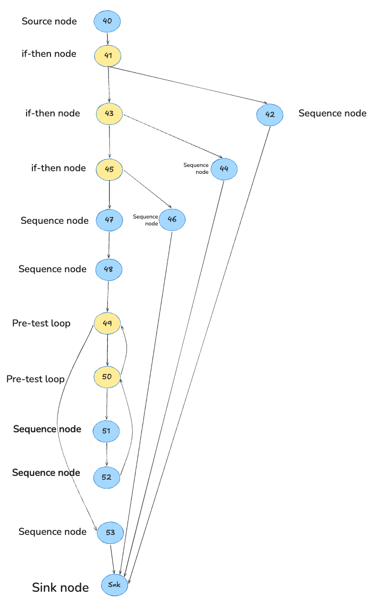

# Testing life cycle: Roman numeral converter

Isabella Martín


## 1. Summary

The system is a roman numeral converter that arrived with fifteen passing tests
and three defects. I applied the three levels of the testing cycle to it and each level found a different kind of problem.

| | Result |
|---|---|
| Inherited suite | 15 tests, passing, unmodified |
| Tests I added | 161, counting parametrised cases (85 unit, 43 integration, 33 acceptance) |
| Branch coverage | 64% before, 99% after |
| Defects found | 3 |
| Found by | integration (1), acceptance (2)|
| Final state | 176 passed, 0 failed |


## 2. Control flow graph of to_roman

These are the lines under analysis:

```python
40  def to_roman(n):
41      if not isinstance(n, int) or isinstance(n, bool):
42          raise RomanError("value must be an integer")
43      if n < _MIN_VALUE:
44          raise RomanError("value must be >= 1")
45      if n > _MAX_VALUE:
46          raise RomanError("value must be <= 3999")
47      out = []
48      remaining = n
49      for value, symbol in _PAIRS:
50          while remaining >= value:
51              out.append(symbol)
52              remaining -= value
53      return "".join(out)
```

It is a control flow graph with one node per statement fragment, labelled by line number where line 41 holds a compound predicate and is drawn as a single if-then node, since the if is one decision of the program.

Snk is a sink node that I added. The formula V(G) = E - N + 2 needs a graph with one entry and one exit, and to_roman has four exits, the three raise statements and the return so Snk is the common exit they all lead to.




## 3. Cyclomatic complexity

Seeing the CFG I see 15 nodes (N = 15) and 19 edges (E = 19). Like this, the cyclomatic complexity is:

V(G) = E - N + 2 = 19 - 15 + 2 = 6.


## 4. Basis set

I derived the six paths with McCabe's baseline method that consists on taking a baseline path first and then flipping one predicate at a time while leaving the rest as they were. The six are linearly independent and between them they cover all nineteen edges.

| # | Path | Flipped | Input | Test |
|---|---|---|---|---|
| P1 | 40 -> 41 -> 43 -> 45 -> 47 -> 48 -> 49 -> 50 -> 51 -> 52 -> 50 -> 49 -> 53 -> Snk | | to_roman(1000) | test_p1_while_body_executes_once |
| P2 | 40 -> 41 -> 42 -> Snk | 41 true | to_roman("MCMXCIV") | test_p2_non_integer_takes_the_guard_on_line_41 |
| P3 | 40 -> 41 -> 43 -> 44 -> Snk | 43 true | to_roman(0) | test_p3_below_the_lower_bound |
| P4 | 40 -> 41 -> 43 -> 45 -> 46 -> Snk | 45 true | to_roman(4000) | test_p4_above_the_upper_bound |
| P5 | 40 -> 41 -> 43 -> 45 -> 47 -> 48 -> 49 -> 53 -> Snk | 49 exhausted | not feasible | |
| P6 | 40 -> 41 -> 43 -> 45 -> 47 -> 48 -> 49 -> 50 -> 49 -> 53 -> Snk | 50 false | to_roman(1) | test_p6_while_predicate_false_on_the_first_pair |


## 5. Definition-use table for to_roman

A c-use is a use of a variable in an assignment or as an argument, and a p-use
is a use inside a predicate. I count out.append(symbol) on line 51 as a c-use
of out, because the name is never rebound and only the list it refers to
changes.

| # | Variable | Def | Use | Kind | Use site |
|---|---|---|---|---|---|
| 1 | n | 40 | 41 | p-use | isinstance guard |
| 2 | n | 40 | 43 | p-use | lower bound guard |
| 3 | n | 40 | 45 | p-use | upper bound guard |
| 4 | n | 40 | 48 | c-use | remaining = n |
| 5 | out | 47 | 51 | c-use | out.append(symbol) |
| 6 | out | 47 | 53 | c-use | "".join(out) |
| 7 | remaining | 48 | 50 | p-use | while guard, first evaluation |
| 8 | remaining | 48 | 52 | c-use | first subtraction |
| 9 | remaining | 52 | 50 | p-use | while guard, after the body ran |
| 10 | remaining | 52 | 52 | c-use | next subtraction |
| 11 | value | 49 | 50 | p-use | while guard |
| 12 | value | 49 | 52 | c-use | remaining -= value |
| 13 | symbol | 49 | 51 | c-use | out.append(symbol) |

So there are thirteen du-pairs in total where six are p-use and seven c-use. A good note is that n is read twice on line 41, once in each operand of the or, but both are p-uses
on the same line, so I count them as the single pair in row 1.

### 5.1 Pairs created by the redefinition of remaining

remaining is defined on line 48 and redefined on line 52, inside the loop
body, which makes line 52 both a use and a definition. See these lines:

```
48  remaining = n            - def
50  while remaining >= value - p-use
52  remaining -= value       - c-use of the old value, then def of the new one
```

Like this rows 7 and 8 of the table above run on the definition from line 48. Rows 9 and
10 exist because line 52 redefines the variable and they are the ones the
loop creates. The guard is evaluated again on the decremented value and each
subtraction feeds the next.

Line 52 also kills line 48. Once the first iteration has run no definition clear
path remains from line 48 to any use, so every later iteration works on the
definition from line 52.

## 6. Integration finding

### 6.1 The defect

Line 17 of converter.py read (5, "IV") instead of (4, "IV"). The table is
scanned in order and (5, "V") comes first, so remaining >= 5 was already
false when to_roman reached the IV entry, which made it unreachable. Control
fell through to (1, "I").

| Input | Before | Specification |
|---|---|---|
| to_roman(4) | IIII | IV |
| to_roman(1994) | MCMXCIIII | MCMXCIV |
| add_roman("II", "II") | IIII | IV |

The fix was committed in b2ba968.

### 6.2 The failing test

```python
def test_add_roman_matches_the_mandatory_examples_of_section_7(a, b, expected):
    assert add_roman(a, b) == expected
```

```
E       AssertionError: assert 'IIII' == 'IV'
```

add_roman is to_roman(from_roman(a) + from_roman(b)), so the test combines
three units and compares the result against the example in section 7 of the
specification.

### 6.3 Why the unit tests of each function pass

A wrong constant is not a missing path. Like this, the unit tests are structural and a
structural test takes its inputs from the control flow graph (one path where the
while guard holds, one where it does not, one through each guard). None of
those requires to_roman(4). The suite reached 100% branch coverage of lines 40
to 53 with (5, "IV") still in place because the defect is in the value of a
constant and not on an edge of the graph.

The inherited suite had the same gap. It checks to_roman at 1, 2, 3, 5, 10,
50, 100, 500 and 1000, none of which has a 4 in any digit. A second defect was also masking the first because section 7 says the result of
add_roman must be accepted by is_valid_roman, and written directly that
invariant passed:

```python
assert is_valid_roman(add_roman("II", "II")) is True    # passed
```

add_roman("II", "II") returned "IIII" and is_valid_roman("IIII") returned
True because from_roman did not check canonical form, which is defect 3.
Two more invariants passed for the same reason which were from_roman(to_roman(4)) == 4
and is_valid_roman(to_roman(4)).

What caught the defect was an oracle outside the system. The value "IV" given
in section 7 and the rule in section 2 that a canonical numeral never repeats a
symbol four times.

```python
def test_the_result_of_add_roman_never_repeats_a_symbol_four_times(a, b):
    assert "IIII" not in add_roman(a, b)    # assert 'IIII' not in 'IIII'
```


## 7. Acceptance criteria

I wrote these three from SPECIFICATION.md and implemented them in
test_acceptance.py at a point where the suite was green and branch
coverage stood at 90%, the measurement in section 8.2. Two of them failed there.

### AC-1. Whitespace at the ends (section 3) failed

Given a roman numeral typed with stray blanks at the beginning or the end,
when the system converts or validates it then the blanks at the ends are
trimmed and the numeral is accepted, while blanks inside it keep it invalid.

```
FAILED test_ac1_from_roman_trims_the_ends_of_its_input[  IV  -4]
        RomanError: invalid roman character:
```

from_roman called s.upper() but not s.strip(). This was fixed in 8d567df.

### AC-2. Canonical form only (section 4) failed

Given a string that represents a value but is not the canonical form of that
value, such as IIII or VV, when the system converts or validates it then
it is rejected with RomanError and is_valid_roman returns False.

```
FAILED test_ac2_from_roman_rejects_a_non_canonical_numeral[IIII]
        DID NOT RAISE <class 'roman.converter.RomanError'>
```

from_roman checked characters and subtractive pairs, then added the symbols
up. Nothing applied the five rules of section 4, this was fixed in e93397c with
_scan_groups and _check_canonical.

### AC-3. Out-of-range result (section 7) passed

Given two roman numerals whose difference is zero or negative, when
subtract_roman is applied, then the system raises RomanError instead of
returning a numeral outside 1 to 3999.

Passed on the original code, since subtract_roman("I", "I") calls
to_roman(0) and the guard on line 43 was already correct.

### 7.1 Why coverage cannot reveal these

Both defects are missing behaviour. s.strip() was never written and neither
were the five canonical rules, so there was no uncovered strip branch and no
uncovered canonical form branch to report. Coverage partitions the code that
exists and reports which parts ran, code that was never written contributes
nothing to the denominator. Like this, removing required behaviour in fact raises coverage.

Coverage answers whether a line or branch ran. Whether the value it produced was
correct is up to the oracle of the test and whether the behaviour is present at
all can only be answered against a specification. That is why the unit level is
planned from the code and the acceptance level from the requirements.


## 8. Coverage

### 8.1 Before, inherited suite only

```
$ pytest --cov=roman.converter --cov-branch --cov-report=term-missing

tests/test_converter.py ...............                                  [100%]

Name                     Stmts   Miss Branch BrPart  Cover   Missing
--------------------------------------------------------------------
src/roman/converter.py      68     24     34      9    64%   42, 44, 46, 58, 61,
                                                            64, 72-74, 79, 83,
                                                            88, 92-96, 100-104,
                                                            108, 112
--------------------------------------------------------------------
TOTAL                       68     24     34      9    64%
============================== 15 passed in 0.05s ==============================
```

### 8.2 After the unit tests, before any fix

```
$ pytest tests/test_converter.py tests/test_unit_to_roman.py tests/test_unit_converter.py \
         --cov=roman.converter --cov-branch --cov-report=term-missing

Name                     Stmts   Miss Branch BrPart  Cover   Missing
--------------------------------------------------------------------
src/roman/converter.py      68      6     34      0    90%   88, 92-96
--------------------------------------------------------------------
TOTAL                       68      6     34      0    90%
============================= 100 passed in 0.10s ==============================
```

90% branch coverage, no partial branches, all tests green and the three defects
still present. The full suite at this commit gave 26 failed and 150 passed.

### 8.3 After the three fixes

```
$ pytest --cov=roman.converter --cov-branch --cov-report=term-missing

tests/test_acceptance.py .................................               [ 18%]
tests/test_converter.py ...............                                  [ 27%]
tests/test_integration.py ...........................................    [ 51%]
tests/test_unit_converter.py ...........................................
.....                                                                    [ 78%]
tests/test_unit_to_roman.py .....................................        [100%]

Name                     Stmts   Miss Branch BrPart  Cover   Missing
--------------------------------------------------------------------
src/roman/converter.py     109      1     62      0    99%   76
--------------------------------------------------------------------
TOTAL                      109      1     62      0    99%
============================= 176 passed in 0.15s ==============================
```

| | Before | Intermediate | After |
|---|---|---|---|
| Branch coverage | 64% | 90% | 99% |
| Partial branches | 9 | 0 | 0 |
| Tests | 15 | 100 | 176 |
| Defects present | 3 | 3 | 0 |

Line 76 is the body of _roundtrip_differs, a helper that defines canonical
form as to_roman(from_roman(s)) == s. Section 4 of the specification warns
against that formula, so _check_canonical applies the five rules directly and
the helper stays unused.

---

## 9. Defects and commits

| # | Commit | Defect | Section | Found at |
|---|---|---|---|---|
| 1 | b2ba968 | _PAIRS held (5, "IV") instead of (4, "IV"), so to_roman(4) gave "IIII" | 2 | integration |
| 2 | 8d567df | from_roman did not trim its input, so "  IV  " was rejected | 3 | acceptance |
| 3 | e93397c | from_roman did not check canonical form, so is_valid_roman("IIII") was True | 4 | acceptance |

The fifteen inherited tests were neither modified nor deleted. The diff against
the original repository prints nothing, which is what proves it:

```
$ git diff upstream/main -- tests/test_converter.py
$ pytest tests/test_converter.py -q
15 passed
```


## 10. Conclusion

Each level of the cycle is planned from a different artifact and each found a
different kind of defect. The unit level, planned from the code, reached
V(G) = 6, a basis set of six paths, all thirteen du-pairs and 90% branch
coverage and found nothing because it drew its inputs from the same source
that held the wrong constant. The integration level found that constant but
only through an oracle outside the system. The acceptance level planned from
the requirements, found two defects that no structural measure could report
because the behaviour was absent.
