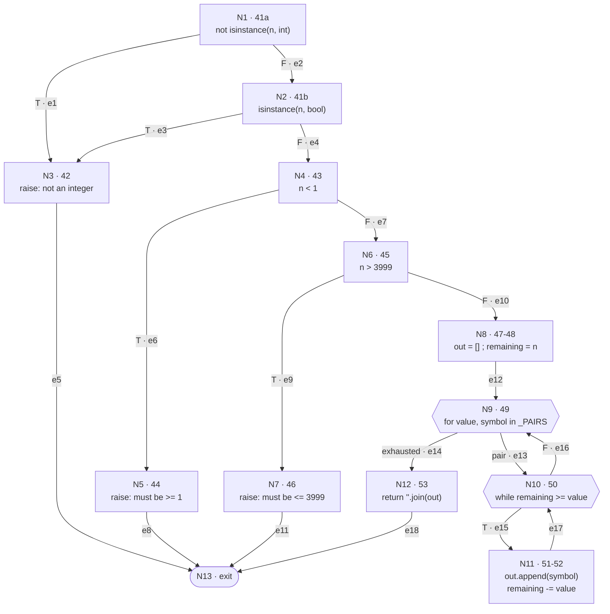

# Testing life cycle — Roman numeral converter

**Escuela Superior Politécnica del Litoral — Software Engineering II**
Isabella Martín · `iimartin@espol.edu.ec`
Repository: <https://github.com/isabellaim/testing-cycle-roman-p1>

---

## 0. Summary

| | Result |
|---|---|
| Inherited suite | 15 tests, passing, **unmodified** |
| Tests added | 161 — unit 85, integration 43, acceptance 33 (parametrised cases) |
| Branch coverage before | **64%** |
| Branch coverage after | **99%** |
| Defects found | 3 |
| Level that found each | integration ×1, acceptance ×2 |
| Final state | 176 passed, 0 failed |

The central finding of this workshop is stated once here and defended in
sections 5 and 6:

> A structural test suite reached **90% branch coverage of `converter.py` with
> zero partial branches, and every test green, while all three defects were
> still present.** Coverage measures which paths were executed. It cannot
> measure whether the value produced along a path was the right one, and it
> cannot point at behaviour that was never written.

---

## 1. Control flow graph of `to_roman`

Source under analysis, `src/roman/converter.py` lines 40 to 53:

```python
40  def to_roman(n):
41      if not isinstance(n, int) or isinstance(n, bool):
42          raise RomanError("value must be an integer")
43      if n < _MIN_VALUE:
44          raise RomanError("value must be >= 1")
45      if n > _MAX_VALUE:
46          raise RomanError("value must be <= 3999")
47      out = []
48      remaining = n
49      for value, symbol in _PAIRS:
50          while remaining >= value:
51              out.append(symbol)
52              remaining -= value
53      return "".join(out)
```

The predicate on line 41 is **compound**. It is decomposed into two nodes, `N1`
and `N2`, one per operand, because `or` short circuits: when `N1` is true the
second operand is never evaluated, and that is a distinct path through the
program. The three `raise` statements and the `return` are routed to a single
exit node `N13`, so the graph is single entry, single exit and `V(G) = E - N + 2`
applies with `P = 1`.

### 1.1 Nodes

| Node | Line | Statement or predicate | Kind |
|---|---|---|---|
| `N1` | 41a | `not isinstance(n, int)` | predicate |
| `N2` | 41b | `isinstance(n, bool)` | predicate |
| `N3` | 42 | `raise RomanError("value must be an integer")` | statement |
| `N4` | 43 | `n < _MIN_VALUE` | predicate |
| `N5` | 44 | `raise RomanError("value must be >= 1")` | statement |
| `N6` | 45 | `n > _MAX_VALUE` | predicate |
| `N7` | 46 | `raise RomanError("value must be <= 3999")` | statement |
| `N8` | 47–48 | `out = []` ; `remaining = n` | block |
| `N9` | 49 | `for value, symbol in _PAIRS` | predicate |
| `N10` | 50 | `while remaining >= value` | predicate |
| `N11` | 51–52 | `out.append(symbol)` ; `remaining -= value` | block |
| `N12` | 53 | `return "".join(out)` | statement |
| `N13` | — | exit | exit |

Lines 47 and 48 are merged into `N8`, and lines 51 and 52 into `N11`: in both
cases the two statements form a sequence with no branch between them, so they
belong to the same node.

**N = 13.**

### 1.2 Edges

| # | Edge | Condition |
|---|---|---|
| e1 | `N1 → N3` | `not isinstance(n, int)` is **true** |
| e2 | `N1 → N2` | false, the second operand is evaluated |
| e3 | `N2 → N3` | `isinstance(n, bool)` is **true** |
| e4 | `N2 → N4` | false |
| e5 | `N3 → N13` | raise |
| e6 | `N4 → N5` | `n < 1` is **true** |
| e7 | `N4 → N6` | false |
| e8 | `N5 → N13` | raise |
| e9 | `N6 → N7` | `n > 3999` is **true** |
| e10 | `N6 → N8` | false |
| e11 | `N7 → N13` | raise |
| e12 | `N8 → N9` | sequence |
| e13 | `N9 → N10` | another pair remains |
| e14 | `N9 → N12` | `_PAIRS` exhausted |
| e15 | `N10 → N11` | `remaining >= value` is **true** |
| e16 | `N10 → N9` | false, next pair |
| e17 | `N11 → N10` | back edge, re-evaluate the while guard |
| e18 | `N12 → N13` | return |

**E = 18.**

### 1.3 The graph



Text form, for reading without a Mermaid renderer:

```
N1 --T--> N3 --------------------------------+
N1 --F--> N2 --T--> N3 ----------------------+
          N2 --F--> N4 --T--> N5 ------------+
                    N4 --F--> N6 --T--> N7 --+
                              N6 --F--> N8   |
                                        |    |
                                        v    |
                                  +---> N9 --(exhausted)--> N12 --> N13
                                  |     |                            ^
                                  |  (pair)                          |
                                  |     v                            |
                                  +-F-- N10 <---+                    |
                                        |       |                    |
                                       (T)      |                    |
                                        v       |                    |
                                       N11 -----+                    |
                                                                     |
  (the four exit arrows above all land on N13) ----------------------+
```

---

## 2. Cyclomatic complexity

$$V(G) = E - N + 2 = 18 - 13 + 2 = \mathbf{7}$$

with **E = 18** edges and **N = 13** nodes, as enumerated in sections 1.1 and 1.2.

Two independent cross checks confirm the value:

| Method | Computation | Result |
|---|---|---|
| Edges and nodes | `18 - 13 + 2` | 7 |
| Binary predicates + 1 | `N1, N2, N4, N6, N9, N10` → `6 + 1` | 7 |
| Enclosed regions of the planar graph + 1 | `6 + 1` | 7 |

The count of predicates is 6 and not 5 precisely because the compound predicate
on line 41 was decomposed. Treating line 41 as a single node would give
`V(G) = 6`, and would hide the path in which a `bool` argument is rejected by
the second operand — the path that `test_p2_bool_reaches_the_second_operand_of_the_compound_guard`
exercises.

---

## 3. Basis set

`V(G) = 7`, so a basis has **7 linearly independent paths**. They are derived
with McCabe's baseline method: one baseline path, then one path per predicate,
flipping that predicate's decision and leaving the others as in the baseline.

| # | Path (sequence of nodes) | Flipped |
|---|---|---|
| **B** | `N1 N2 N4 N6 N8 N9 N10 N11 N10 N9 N12 N13` | — (baseline) |
| **P1** | `N1 N3 N13` | `N1` → true |
| **P2** | `N1 N2 N3 N13` | `N2` → true |
| **P3** | `N1 N2 N4 N5 N13` | `N4` → true |
| **P4** | `N1 N2 N4 N6 N7 N13` | `N6` → true |
| **P5** | `N1 N2 N4 N6 N8 N9 N12 N13` | `N9` → exhausted at once |
| **P6** | `N1 N2 N4 N6 N8 N9 N10 N9 N12 N13` | `N10` → false at once |

Independence check: each path introduces at least one edge that no earlier path
uses — P1 introduces e1, P2 introduces e3, P3 introduces e6, P4 introduces e9,
P5 introduces e14 in a body-free traversal, P6 introduces e16, and B introduces
e15 and e17. The seven incidence vectors over the 18 edges are therefore
linearly independent.

### 3.1 Test data

| Path | Input | Realised by |
|---|---|---|
| B | `to_roman(1000)` → `"M"` | `test_p0_while_body_executes_once` |
| P1 | `to_roman("MCMXCIV")` | `test_p1_non_integer_takes_the_first_guard` |
| P2 | `to_roman(True)` | `test_p2_bool_reaches_the_second_operand_of_the_compound_guard` |
| P3 | `to_roman(0)` | `test_p3_below_the_lower_bound` |
| P4 | `to_roman(4000)` | `test_p4_above_the_upper_bound` |
| P5 | **not feasible** — see below | — |
| P6 | `to_roman(1)` → `"I"` | `test_p6_while_predicate_false_on_the_first_pair` |

Two honest qualifications about this table:

1. **P5 is infeasible.** It requires `N9` to find `_PAIRS` exhausted on its first
   evaluation, which means an empty table. `_PAIRS` is a module level constant
   with 13 entries, so no input can produce that traversal. P5 is a linearly
   independent path *of the graph* and belongs in the basis; it is simply not
   realisable. Infeasible basis paths are expected, and finding one is a normal
   outcome of the method, not an error in the graph.
2. **The loop paths are traversed as combinations, not in isolation.** With 13
   entries in `_PAIRS`, every terminating execution walks `N9 → N10` thirteen
   times. B and P6 name the distinguishing edge each input first exercises
   (`e15`/`e17` for B, `e16` for P6); no single input walks exactly B and
   nothing else. This is the ordinary situation for a graph containing a loop:
   the basis spans the path space, and real executions are linear combinations
   of the basis, not members of it.

---

## 4. Definition–use table for `to_roman`

Notation: **c-use** is a computational use, in the right hand side of an
assignment or an argument; **p-use** is a use inside a predicate. A pair is
written `(variable, def line, use line)`.

**Convention adopted:** `out.append(symbol)` on line 51 is recorded as a **c-use
of `out`**, not as a definition, because the name `out` is not rebound — the
list object it already points at is mutated. Under the alternative convention,
in which a mutating method call is also a definition, line 51 would add the two
pairs `(out, 51, 51)` and `(out, 51, 53)`.

| Variable | Definitions | Uses | Use kind | du-pairs |
|---|---|---|---|---|
| `n` | 40 (parameter) | 41a, 41b, 43, 45, 48 | p, p, p, p, **c** | `(n,40,41a)` p · `(n,40,41b)` p · `(n,40,43)` p · `(n,40,45)` p · `(n,40,48)` c |
| `out` | 47 | 51, 53 | c, c | `(out,47,51)` c · `(out,47,53)` c |
| `remaining` | 48, **52** | 50, 52 | p, c | `(remaining,48,50)` p · `(remaining,48,52)` c · `(remaining,52,50)` p · `(remaining,52,52)` c |
| `value` | 49 (loop target) | 50, 52 | p, c | `(value,49,50)` p · `(value,49,52)` c |
| `symbol` | 49 (loop target) | 51 | c | `(symbol,49,51)` c |

**Total: 14 du-pairs — 7 p-use pairs and 7 c-use pairs.**

### 4.1 The pairs created by the redefinition of `remaining`

The workshop asks specifically for these. `remaining` is defined at line 48 and
**redefined at line 52**, inside the `while` body, so line 52 is both a use and
a definition:

```
48  remaining = n            <- def
50  while remaining >= value <- p-use
52  remaining -= value       <- c-use of the old value, then def of the new one
```

| du-pair | Kind | Meaning | Killed by |
|---|---|---|---|
| `(remaining, 48, 50)` | p-use | the guard is evaluated for the first time, on the value coming from `n` | line 52 on the first iteration |
| `(remaining, 48, 52)` | c-use | the first subtraction reads the value coming from `n` | line 52, itself |
| `(remaining, 52, 50)` | p-use | **created by the redefinition** — the guard is re-evaluated after the loop body ran, on the decremented value | the next execution of line 52 |
| `(remaining, 52, 52)` | c-use | **created by the redefinition** — one iteration feeds the next through the accumulator | the next execution of line 52 |

The definition at line 52 **kills** the definition at line 48: after the first
iteration, no definition-clear path from line 48 to any use survives. The last
two pairs are the ones that only exist because of the redefinition, and both are
covered — `(remaining, 52, 52)` needs the same pair to be consumed at least
twice in a row, which `test_p0_while_body_executes_repeatedly` provides with
`to_roman(3000)` → `"MMM"`.

### 4.2 All-uses coverage

All 14 pairs are exercised by the suite, so the unit tests satisfy the **all-uses**
criterion for `to_roman`:

| Pair group | Covering input |
|---|---|
| `(n,40,41a)` | `to_roman("MCMXCIV")` |
| `(n,40,41b)` | `to_roman(True)` |
| `(n,40,43)` | `to_roman(0)` |
| `(n,40,45)` | `to_roman(4000)` |
| `(n,40,48)`, `(out,47,51)`, `(out,47,53)`, `(remaining,48,50)`, `(remaining,48,52)`, `(value,49,50)`, `(value,49,52)`, `(symbol,49,51)` | `to_roman(3999)` |
| `(remaining,52,50)`, `(remaining,52,52)` | `to_roman(3000)` |

And this is where the workshop's point starts to appear. **All-uses coverage is
satisfied, branch coverage of `to_roman` is 100%, and `to_roman(4)` still
returned `"IIII"`.** Both criteria ask which paths ran. Neither asks whether the
value carried along the path was correct.

---

## 5. Integration finding

### 5.1 The defect

`_PAIRS`, line 17 of `converter.py`, held:

```python
(5, "V"),
(5, "IV"),   # <- wrong: the value of IV is 4, not 5
(1, "I"),
```

The table is scanned in order. `(5, "V")` is tried first and consumes the 5,
so when `to_roman` reaches `(5, "IV")` the condition `remaining >= 5` is false
by construction — **the `IV` entry was unreachable for every input**. Control
fell through to `(1, "I")`, which appended `I` four times.

| Input | Before | Specification |
|---|---|---|
| `to_roman(4)` | `IIII` | `IV` |
| `to_roman(14)` | `XIIII` | `XIV` |
| `to_roman(1994)` | `MCMXCIIII` | `MCMXCIV` |
| `add_roman("II", "II")` | `IIII` | `IV` |

The fix is one character, `(5, "IV")` → `(4, "IV")`, in commit `b2ba968`.

### 5.2 The failing integration test

```python
@pytest.mark.parametrize("a,b,expected", [("II", "II", "IV"), ...])
def test_add_roman_matches_the_mandatory_examples_of_section_7(a, b, expected):
    assert add_roman(a, b) == expected
```

```
E       AssertionError: assert 'IIII' == 'IV'
```

`add_roman` is `to_roman(from_roman(a) + from_roman(b))`. The test combines
three units — `from_roman`, integer addition, `to_roman` — and checks the
composition against the mandatory example of section 7 of the specification.

### 5.3 Why the unit tests of each function pass

This is the question the workshop asks, and it has three distinct answers that
stack on top of each other.

**First: a wrong constant is not a missing path.**
The unit tests of Part 3 are *structural*, derived from the source as the
workshop requires. A structural test chooses its **inputs** from the control
flow graph: it needs a path where the `while` guard is true, a path where it is
false, a path through each guard. Every one of those is available without ever
calling `to_roman(4)`. The suite reached **100% branch coverage of lines 40–53
with zero partial branches** while `(5, "IV")` was still in the table. The
defect does not live on an edge of the graph. It lives in the *value* of a
module level constant, and no path-based criterion — statement, branch,
all-uses, or the full basis set of section 3 — has anything to say about it.

**Second: the inherited suite chose its inputs from the same blind spot.**
The 15 inherited tests check `to_roman` at 1, 2, 3, 5, 10, 50, 100, 500 and
1000. Not one of those has a 4 in any digit position, which is the only way to
reach the broken entry. The round trips, `from_roman(to_roman(7))` and
`from_roman(to_roman(58))`, avoid it too.

**Third, and the most interesting: a second defect was masking the first.**
Section 7 also states the invariant *"the result of `add_roman` is always a
string that `is_valid_roman` accepts"*. Written directly, that integration test
**passed** on the broken code:

```python
def test_the_result_of_add_roman_is_accepted_by_is_valid_roman(a, b):
    assert is_valid_roman(add_roman(a, b)) is True    # PASSED with a='II', b='II'
```

`add_roman("II", "II")` produced `"IIII"`, and `is_valid_roman("IIII")` answered
`True` — because `from_roman` had no canonical form validation at all
(defect 3, section 6.2). The two defects cancelled each other exactly. Two more
invariant tests passed for the same reason:

| Test | Result on broken code | Why |
|---|---|---|
| `is_valid_roman(add_roman("II","II"))` | passed | `is_valid_roman("IIII")` was `True` |
| `from_roman(to_roman(4)) == 4` | passed | `from_roman("IIII")` was `4` |
| `is_valid_roman(to_roman(4))` | passed | as above |

An invariant checked between two components of the same system is only as
trustworthy as the weaker component. What actually caught the defect was an
oracle **external to the system**: the mandatory value `"IV"` written in section
7 of the specification, and the rule from section 2 that a canonical numeral
never contains four identical symbols in a row:

```python
def test_the_result_of_add_roman_never_repeats_a_symbol_four_times(a, b):
    result = add_roman(a, b)
    assert "IIII" not in result     # AssertionError: assert 'IIII' not in 'IIII'
```

---

## 6. Acceptance criteria

Written from `SPECIFICATION.md` only, in Given / When / Then form. Implemented
in `tests/test_acceptance.py`. All three were written while the suite was green
and branch coverage stood at **90%**.

### AC-1 — Whitespace at the ends is tolerated (spec section 3) — **FAILED**

> **Given** a roman numeral typed into a user facing field with stray blanks at
> the beginning or the end,
> **When** the system converts or validates it,
> **Then** the blanks at the ends are trimmed and the numeral is accepted, while
> blanks inside the numeral keep it invalid.

```
FAILED test_ac1_from_roman_trims_the_ends_of_its_input[  IV  -4]
        RomanError: invalid roman character:
FAILED test_ac1_is_valid_roman_accepts_a_numeral_with_blanks_at_the_ends
        assert False is True
```

`from_roman` called `s.upper()` but never `s.strip()`, so a leading blank
reached the character scan and was rejected as an invalid symbol. Fixed in
`8d567df`.

### AC-2 — Only the canonical form is accepted (spec section 4) — **FAILED**

> **Given** a string that represents a value but is not the canonical form of
> that value, such as `IIII`, `VIIII`, `XXXX`, `VV` or `IVI`,
> **When** the system converts or validates it,
> **Then** it is rejected with `RomanError`, and `is_valid_roman` answers
> `False`.

```
FAILED test_ac2_from_roman_rejects_a_non_canonical_numeral[IIII]
        DID NOT RAISE <class 'roman.converter.RomanError'>
FAILED test_ac2_is_valid_roman_rejects_a_non_canonical_numeral[IIII]
        assert True is False
```

`from_roman` validated characters and subtractive pairs, then simply added the
symbols up. Nothing checked the five rules of section 4. Fixed in `e93397c` by
`_scan_groups` plus `_check_canonical`.

### AC-3 — An out-of-range result is rejected (spec section 7) — **passed**

> **Given** two roman numerals whose difference is zero or negative,
> **When** `subtract_roman` is applied to them,
> **Then** the system raises `RomanError` instead of returning a numeral outside
> 1 to 3999.

Passed on the original code: `subtract_roman("I", "I")` calls `to_roman(0)`,
and the guard on line 43 was already correct. Included to show the criteria were
derived from the specification rather than reverse engineered from the known
failures.

### 6.1 Why code coverage cannot reveal a defect of this kind

AC-1 and AC-2 failed on code that reported **90% branch coverage with zero
partial branches**. That is not a paradox; it is the definition of the metric.

Coverage is a function of the code that exists. It partitions the statements and
edges that are present and reports which of them were executed. **The defects
behind AC-1 and AC-2 are missing behaviour: `s.strip()` was not written, and the
five canonical rules were not written.** There was no `strip` branch left
untaken and no canonical-form branch left untaken, because neither existed. A
missing statement contributes nothing to the denominator, so the metric is
structurally blind to it — and in fact removing required behaviour *raises*
coverage, since the deleted code can no longer be reported as uncovered.

The general statement of the limit:

| Question | Answered by |
|---|---|
| Was this line, branch or du-pair executed? | coverage, a structural measure |
| Was the value produced along it correct? | the oracle of the test — section 5 |
| Is the required behaviour present at all? | only a specification — this section |

Only a document written independently of the code can answer the third question.
This is precisely the reason the testing life cycle plans each level from a
different artifact: unit testing from the code, acceptance testing from the
requirements. A suite planned entirely from the code can never exceed what the
code already does.

### 6.2 The trap the specification warns about

Section 4 of the specification says explicitly:

> Do not define canonical form as `to_roman(from_roman(s)) == s`. That formula
> uses the code as its own oracle, so a defect in `to_roman` would make the
> formula accept it.

That formula is already in the repository, as the unused helper
`_roundtrip_differs` on lines 79–80. It was left unused deliberately, and it is
**the only uncovered line in the final report**. Had `_check_canonical` been
implemented with it, the result would have been:

```
_roundtrip_differs(4, "IIII")  ->  to_roman(4) != "IIII"  ->  "IIII" != "IIII"  ->  False
```

The broken `to_roman` would have certified `"IIII"` as the canonical form of 4,
and AC-2 would have passed against a system that was still wrong. `_check_canonical`
therefore implements the five normative rules of section 4 directly, and does not
call `to_roman` at all.

---

## 7. Coverage

### 7.1 Before — inherited suite only (Part 2)

```
$ pytest --cov=roman.converter --cov-branch --cov-report=term-missing

tests/test_converter.py ...............                                  [100%]

================================ tests coverage ================================
Name                     Stmts   Miss Branch BrPart  Cover   Missing
--------------------------------------------------------------------
src/roman/converter.py      68     24     34      9    64%   42, 44, 46, 58, 61,
                                                            64, 72-74, 79, 83,
                                                            88, 92-96, 100-104,
                                                            108, 112
--------------------------------------------------------------------
TOTAL                       68     24     34      9    64%
============================== 15 passed in 0.05s ==============================
```

**64% branch coverage, 9 partial branches.** Every error path was unexercised,
and `is_valid_roman`, `add_roman` and `subtract_roman` were never called at all.

### 7.2 Intermediate — after the structural unit tests, before any fix

```
$ pytest tests/test_converter.py tests/test_unit_to_roman.py tests/test_unit_converter.py \
         --cov=roman.converter --cov-branch --cov-report=term-missing

================================ tests coverage ================================
Name                     Stmts   Miss Branch BrPart  Cover   Missing
--------------------------------------------------------------------
src/roman/converter.py      68      6     34      0    90%   88, 92-96
--------------------------------------------------------------------
TOTAL                       68      6     34      0    90%
============================= 100 passed in 0.10s ==============================
```

**90% branch coverage, 0 partial branches, 100 tests green — and all three
defects still present.** The six remaining uncovered lines were the two helpers
that nothing called. This is the snapshot the whole report is about, and it is
the state against which the integration and acceptance tests were written.

Running the full suite at this same commit:

```
26 failed, 150 passed
```

### 7.3 After — full suite, all three fixes applied

```
$ pytest --cov=roman.converter --cov-branch --cov-report=term-missing

tests/test_acceptance.py .................................              [ 18%]
tests/test_converter.py ...............                                  [ 27%]
tests/test_integration.py ...........................................    [ 51%]
tests/test_unit_converter.py ...........................................
.....                                                                    [ 78%]
tests/test_unit_to_roman.py .....................................        [100%]

================================ tests coverage ================================
Name                     Stmts   Miss Branch BrPart  Cover   Missing
--------------------------------------------------------------------
src/roman/converter.py     109      1     62      0    99%   80
--------------------------------------------------------------------
TOTAL                      109      1     62      0    99%
============================= 176 passed in 0.15s ==============================
```

**99% branch coverage, 0 partial branches, 176 passed, 0 failed.**

| | Before | Intermediate | After |
|---|---|---|---|
| Branch coverage | 64% | 90% | **99%** |
| Partial branches | 9 | 0 | 0 |
| Tests | 15 | 100 | 176 |
| Defects present | 3 | 3 | **0** |

The single uncovered line is 80, the body of `_roundtrip_differs`, the
self-referential oracle that section 4 of the specification forbids. It is left
in place and left uncovered on purpose; see section 6.2.

Raw captures are in [`docs/evidence/`](docs/evidence/).

### 7.4 Independent verification

Beyond the suite, the fixed system was checked against every normative table in
the specification, and exhaustively over the whole supported range, by
[`docs/verify_specification.py`](docs/verify_specification.py):

```
$ python docs/verify_specification.py

sections 2, 3, 4, 5, 6, 7 reference tables ............... 33 checks, all ok
from_roman(to_roman(n)) == n for n in 1..3999 ............ no mismatches
is_valid_roman(to_roman(n)) for n in 1..3999 ............. no mismatches

35 passed, 0 failed
```

---

## 8. Defects and commits

Each fix is a separate commit whose message names the level of testing that
found the defect, as required by Part 6.

| # | Commit | Defect | Spec section | Found at |
|---|---|---|---|---|
| 1 | `b2ba968` | `_PAIRS` held `(5, "IV")` instead of `(4, "IV")`, making the entry unreachable, so `to_roman(4)` was `"IIII"` | §2 | **integration** |
| 2 | `8d567df` | `from_roman` never trimmed its input, so `"  IV  "` was rejected | §3 | **acceptance** |
| 3 | `e93397c` | `from_roman` had no canonical form validation, so `"IIII"` returned 4 and `is_valid_roman("IIII")` was `True` | §4 | **acceptance** |

```
e93397c fix(acceptance): reject non canonical numerals in from_roman per spec section 4
8d567df fix(acceptance): trim surrounding whitespace in from_roman per spec section 3
b2ba968 fix(integration): correct the value of the IV entry in _PAIRS per spec section 2
e059999 test: add unit, integration and acceptance levels of the testing cycle
```

The 15 inherited tests in `tests/test_converter.py` were **not modified or
deleted**, and all 15 still pass:

```
$ git diff upstream/main -- tests/test_converter.py
$ pytest tests/test_converter.py -q
15 passed
```

---

## 9. Conclusion

Each level of the testing life cycle is planned from a different artifact, and
that is why each one finds a different kind of defect. This system demonstrated
all three cases in a single afternoon:

- **The unit level, planned from the code**, produced a graph with `V(G) = 7`, a
  basis set of 7 paths, all-uses coverage of `to_roman`, and 90% branch coverage
  with no partial branches. It found **no defects**. It could not: it derived its
  inputs from the same source that contained the wrong constant.
- **The integration level, planned from the design in section 7**, found the
  `_PAIRS` defect — but only through an oracle external to the system. The
  invariant test that compared two of the system's own components passed,
  because a second defect masked the first.
- **The acceptance level, planned from the requirements**, found two defects
  that no structural measure could ever have reported, because the required
  behaviour was absent rather than untested.

The number to remember is the intermediate one: **90% branch coverage, zero
partial branches, every test green, three defects present.** Coverage bounds how
much of the existing code was exercised. It says nothing about whether that code
is the code the specification asked for.

---

## Reproducing

```bash
git clone https://github.com/isabellaim/testing-cycle-roman-p1.git
cd testing-cycle-roman-p1
python3 -m venv .venv && source .venv/bin/activate
pip install -r requirements.txt -e .

pytest                                                          # 176 passed
pytest --cov=roman.converter --cov-branch --cov-report=term-missing   # 99%
```

## References

[1] Jorgensen, P. *Software Testing: A Craftsman's Approach*, chapters 1, 2, 8, 9 and 10.
[2] Pressman, R. and Maxim, B. *Software Engineering: A Practitioner's Approach*, chapter 22.
[3] Course slides, lecture 1c: Software Testing, Basic Definitions.
[4] Course slides, lecture 2a: Test Cases Identification.
